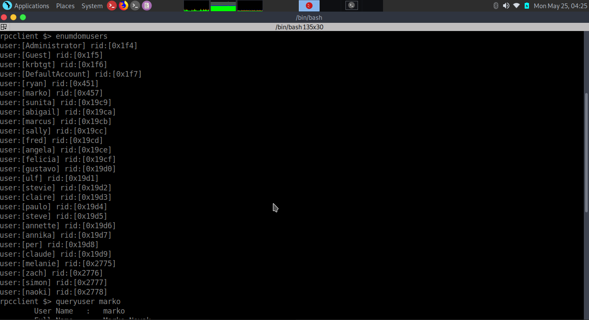
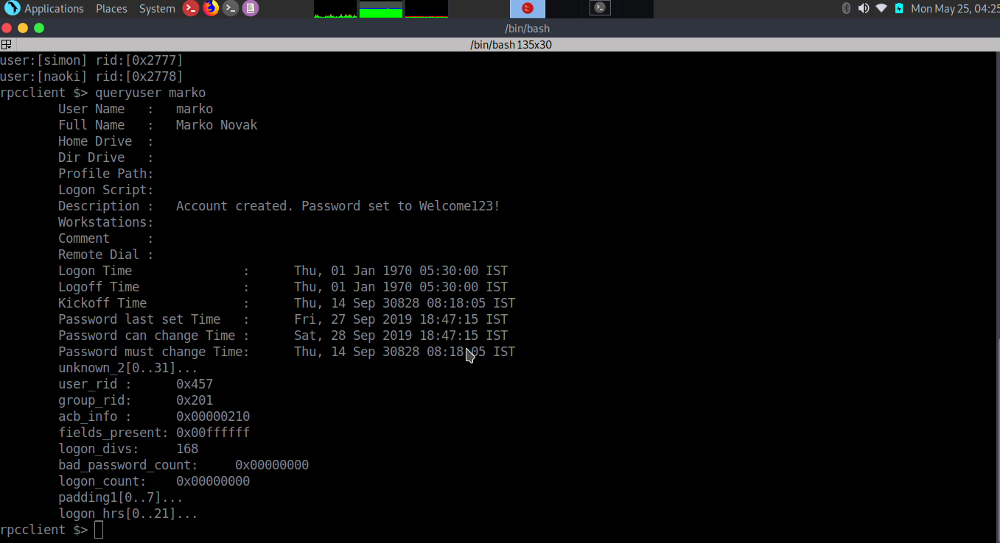
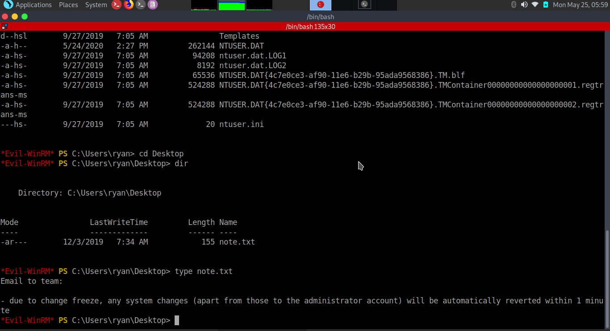
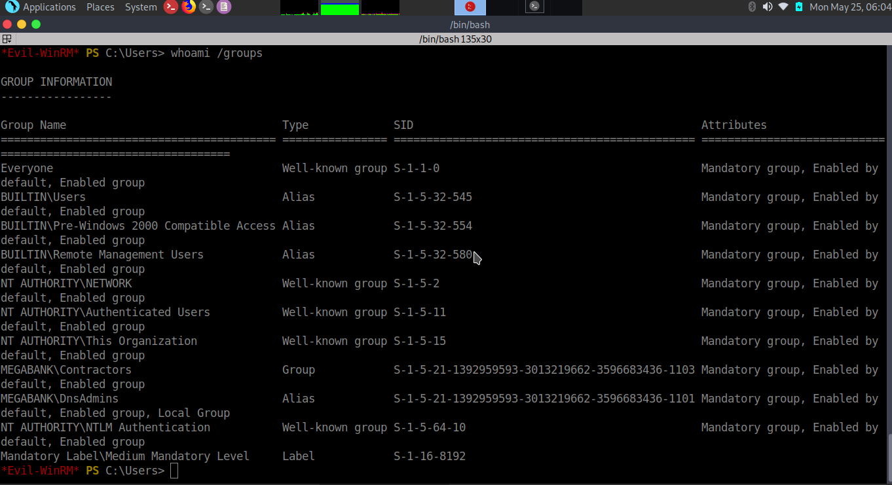
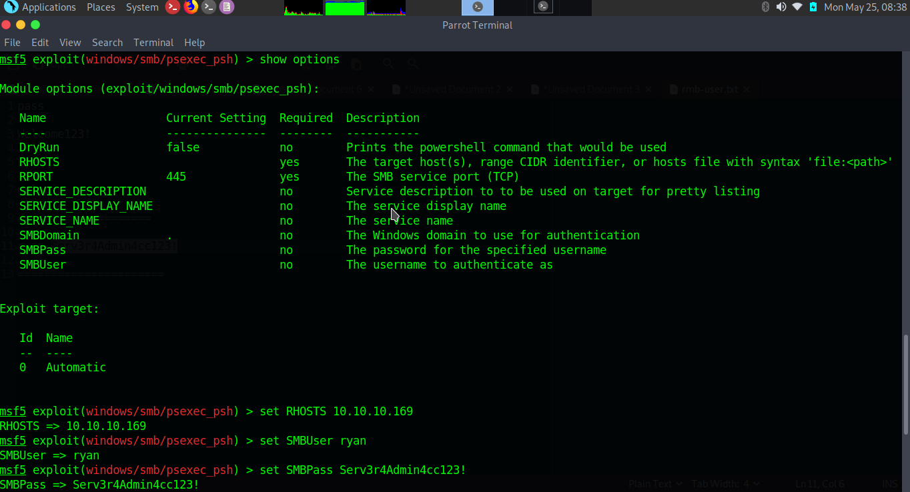
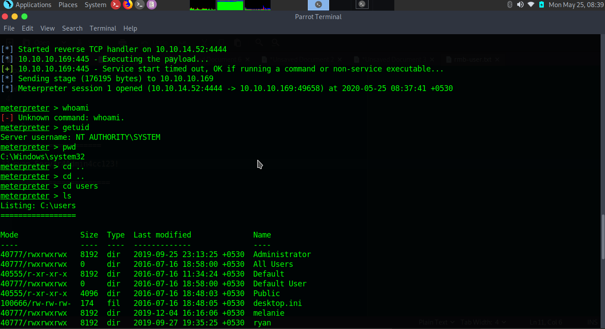

```css
title: "Hack the box - Resolute"
author: mayomacam
date: "2020-06-14"
subject: "CTF Writeup"
keywords: [Hack the box, Box, CTF, Security]
```


##### Resolute is a medium rated windows machine created by egre55, which includes a lot of enumeration and a dll injection over the dns service for privilege escalation.

# Information Gathering

## Nmap
##### We begin our reconnaissance by running an Nmap scan checking default scripts and testing for vulnerabilities.

```markdown
$nmap -sC -sV -p- 10.10.10.169
Starting Nmap 7.80 ( https://nmap.org ) at 2020-01-17 19:54 EST
Nmap scan report for 10.10.10.169
Host is up (0.013s latency).

PORT     STATE SERVICE      VERSION
53/tcp   open  domain?
| fingerprint-strings: 
|   DNSVersionBindReqTCP: 
|     version
|_    bind
88/tcp   open  kerberos-sec Microsoft Windows Kerberos (server time: 2020-01-18 01:02:23Z)
135/tcp  open  msrpc        Microsoft Windows RPC
139/tcp  open  netbios-ssn  Microsoft Windows netbios-ssn
389/tcp  open  ldap         Microsoft Windows Active Directory LDAP (Domain: megabank.local, Site: Default-First-Site-Name)
445/tcp  open  microsoft-ds Windows Server 2016 Standard 14393 microsoft-ds (workgroup: MEGABANK)
464/tcp  open  kpasswd5?
593/tcp  open  ncacn_http   Microsoft Windows RPC over HTTP 1.0
636/tcp  open  tcpwrapped
3268/tcp open  ldap         Microsoft Windows Active Directory LDAP (Domain: megabank.local, Site: Default-First-Site-Name)
3269/tcp open  tcpwrapped
5985/tcp open  http         Microsoft HTTPAPI httpd 2.0 (SSDP/UPnP)
|_http-server-header: Microsoft-HTTPAPI/2.0
|_http-title: Not Found
9389/tcp open  mc-nmf       .NET Message Framing
1 service unrecognized despite returning data. If you know the service/version, please submit the following fingerprint at https://nmap.org/cgi-bin/submit.cgi?new-service :
SF-Port53-TCP:V=7.80%I=7%D=1/17%Time=5E225762%P=x86_64-pc-linux-gnu%r(DNSV
SF:ersionBindReqTCP,20,"\0\x1e\0\x06\x81\x04\0\x01\0\0\0\0\0\0\x07version\
SF:x04bind\0\0\x10\0\x03");
Service Info: Host: RESOLUTE; OS: Windows; CPE: cpe:/o:microsoft:windows

Host script results:
|_clock-skew: mean: 2h47m32s, deviation: 4h37m09s, median: 7m30s
| smb-os-discovery: 
|   OS: Windows Server 2016 Standard 14393 (Windows Server 2016 Standard 6.3)
|   Computer name: Resolute
|   NetBIOS computer name: RESOLUTE\x00
|   Domain name: megabank.local
|   Forest name: megabank.local
|   FQDN: Resolute.megabank.local
|_  System time: 2020-01-17T17:03:05-08:00
| smb-security-mode: 
|   account_used: guest
|   authentication_level: user
|   challenge_response: supported
|_  message_signing: required
| smb2-security-mode: 
|   2.02: 
|_    Message signing enabled and required
| smb2-time: 
|   date: 2020-01-18T01:03:02
|_  start_date: 2020-01-17T22:07:40

Service detection performed. Please report any incorrect results at https://nmap.org/submit/ .
Nmap done: 1 IP address (1 host up) scanned in 143.26 seconds
```

##### From the above output we can see that ports, **53**, **88**, **135**, **139**, **389** , **445**, **464**, **593**, **636**, **3268**, **3269**, **5985** ,**9389** and some others ports are open. 

# Exploitation
##### There is no port 80 so i start with rpc client.


##### we got domain name and users name.


##### when we do queryuser on marko we got credential.


##### After we got user and pass so try on smb but we can't login. There is one thing is sure then pass belong to different user. So i create a user list and use hydra to check about pass belongs to which user.


##### Now we have user and pass so we login smb using smbclient to see what we can access. And download some files to check but nothing found.

# User Flag
##### Then i tried metaspolit winrm exploit but can't login. When i search online then i found evil winrm tool for windows.


##### Evil winrm work and we got shell.


##### And we got our user flag.

## Root Flag

##### After looking around melanie’s home directory and not finding anything useful, I went to the filesystem C drive. Normally we didn't get anything but i try to see hidden files then PSTranscripts when we check whole folder we got our file.
```sh
*Evil-WinRM* PS C:\PSTranscripts\20191203>type PowerShell_transcript.RESOLUTE.OJuoBGhU.20191203063201.txt
**********************                                                                                                                                                                                                                                                                                              [9/576]
Windows PowerShell transcript start
Start time: 20191203063201
Username: MEGABANK\ryan                                      
RunAs User: MEGABANK\ryan    
Machine: RESOLUTE (Microsoft Windows NT 10.0.14393.0)
Host Application: C:\Windows\system32\wsmprovhost.exe -Embedding
Process ID: 2800              
PSVersion: 5.1.14393.2273    
PSEdition: Desktop    
PSCompatibleVersions: 1.0, 2.0, 3.0, 4.0, 5.0, 5.1.14393.2273                                                                                                
BuildVersion: 10.0.14393.2273
CLRVersion: 4.0.30319.42000
WSManStackVersion: 3.0
PSRemotingProtocolVersion: 2.3
SerializationVersion: 1.1.0.1
**********************
Command start time: 20191203063455
**********************
PS>TerminatingError(): "System error."
>> CommandInvocation(Invoke-Expression): "Invoke-Expression"
>> ParameterBinding(Invoke-Expression): name="Command"; value="-join($id,'PS ',$(whoami),'@',$env:computername,' ',$((gi $pwd).Name),'> ')
if (!$?) { if($LASTEXITCODE) { exit $LASTEXITCODE } else { exit 1 } }"
>> CommandInvocation(Out-String): "Out-String"
>> ParameterBinding(Out-String): name="Stream"; value="True"
**********************
Command start time: 20191203063455
**********************
PS>ParameterBinding(Out-String): name="InputObject"; value="PS megabank\ryan@RESOLUTE Documents> "
PS megabank\ryan@RESOLUTE Documents>
**********************
Command start time: 20191203063515
**********************
PS>CommandInvocation(Invoke-Expression): "Invoke-Expression"
>> ParameterBinding(Invoke-Expression): name="Command"; value="cmd /c net use X: \\fs01\backups ryan Serv3r4Admin4cc123!

if (!$?) { if($LASTEXITCODE) { exit $LASTEXITCODE } else { exit 1 } }"
>> CommandInvocation(Out-String): "Out-String"
>> ParameterBinding(Out-String): name="Stream"; value="True"
**********************
Windows PowerShell transcript start
Start time: 20191203063515
Username: MEGABANK\ryan
RunAs User: MEGABANK\ryan
Machine: RESOLUTE (Microsoft Windows NT 10.0.14393.0)
Host Application: C:\Windows\system32\wsmprovhost.exe -Embedding
Process ID: 2800
PSVersion: 5.1.14393.2273
PSEdition: Desktop
PSCompatibleVersions: 1.0, 2.0, 3.0, 4.0, 5.0, 5.1.14393.2273
BuildVersion: 10.0.14393.2273
CLRVersion: 4.0.30319.42000
WSManStackVersion: 3.0
PSRemotingProtocolVersion: 2.3
SerializationVersion: 1.1.0.1
**********************
**********************
Command start time: 20191203063515
**********************
PS>CommandInvocation(Out-String): "Out-String"
>> ParameterBinding(Out-String): name="InputObject"; value="The syntax of this command is:"
cmd : The syntax of this command is:
At line:1 char:1
+ cmd /c net use X: \\fs01\backups ryan Serv3r4Admin4cc123!
+ ~~~~~~~~~~~~~~~~~~~~~~~~~~~~~~~~~~~~~~~~~~~~~~~~~~~~~~~~~
    + CategoryInfo          : NotSpecified: (The syntax of this command is::String) [], RemoteException
    + FullyQualifiedErrorId : NativeCommandError
cmd : The syntax of this command is:
At line:1 char:1
+ cmd /c net use X: \\fs01\backups ryan Serv3r4Admin4cc123!
+ ~~~~~~~~~~~~~~~~~~~~~~~~~~~~~~~~~~~~~~~~~~~~~~~~~~~~~~~~~
    + CategoryInfo          : NotSpecified: (The syntax of this command is::String) [], RemoteException
    + FullyQualifiedErrorId : NativeCommandError
**********************
Windows PowerShell transcript start
Start time: 20191203063515
Username: MEGABANK\ryan
RunAs User: MEGABANK\ryan
Machine: RESOLUTE (Microsoft Windows NT 10.0.14393.0)
Host Application: C:\Windows\system32\wsmprovhost.exe -Embedding
Process ID: 2800
PSVersion: 5.1.14393.2273
PSEdition: Desktop
PSCompatibleVersions: 1.0, 2.0, 3.0, 4.0, 5.0, 5.1.14393.2273
BuildVersion: 10.0.14393.2273
CLRVersion: 4.0.30319.42000
WSManStackVersion: 3.0
PSRemotingProtocolVersion: 2.3
SerializationVersion: 1.1.0.1
**********************
```
##### we got second user and password.
```sh
cmd /c net use X: \\fs01\backups ryan Serv3r4Admin4cc123!
```

##### Then we login using second creds . And we logged in.



##### First we check all permissions we have as ryan user.


##### we are dnsadmin so i search online for privilege escalation for dns.Then we create a exploit.


##### But this didn't work for me so i again check online and find metasploit exploit.



##### we got our root.txt


# Conclusion
##### User was easy but for root it's take my quite time.
